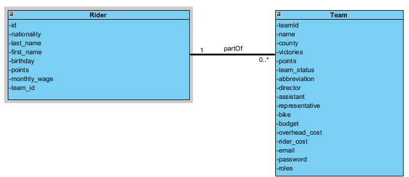

# Jelle Leus (202186597)

- [  ] Web Services:
  - https://github.com/Web-IV/2324-webservices-JelleLeus1996
  - https://webservice-cycling.onrender.com

**Logingegevens**

- Gebruikersnaam/e-mailadres: jelle.leus@student.hogent.be
- Wachtwoord: DgUnA5_UnO"

## Projectbeschrijving

Wielerdatabase waarin rensters en teams aanwezig zijn.
De UCI is ook geregistreerd als team en heeft als enige de macht (als admin) om alle details van rensters en teams te bekijken, rensters en teams toe te voegen of te verwijderen.

De vertegenwoordigers van de 'echte' teams kunnen alle teams en rensters zien (in beperkte vorm, bijv. zonder de financiële data) en kunnen alle details van hun eigen team en rensters opvragen. Ook updates over hun eigen team en eigen rensters kunnen zijn doen.

## API calls

### Teams

- `GET /api/riders`: Alle rensters ophalen met beperkte info (geen financiële data)
- `GET /api/riders/allInfo`: Alle rensters ophalen met alle info (incl. financiële data). 
- `GET /api/riders/all/getAllRidersWithTeam`: Alle rensters ophalen met bijhorende teams.
- `GET /api/riders/full-name/:first_name/:last_name`: Renster met een bepaalde voor- en achternaam ophalen
- `GET /api/riders/:id`: Renster met een bepaald id ophalen
- `GET /api/riders/team/:team_id`: Alle rensters ophalen van een bepaald team

- `POST /api/riders`: Renster toevoegen

- `PUT /api/riders/:id`: Renster met een bepaald id aanpassen

- `DELETE /api/riders/:id`: Renster met een bepaald id verwijderen

### Riders

- `POST /api/teams/login`: Inloggen in het systeem  

- `GET /api/teams`: Alle teams ophalen met beperkte info (geen financiële data)
- `GET /api/teams/allInfo`: Alle teams ophalen met alle info (incl. financiële data). 
- `GET /api/teams/:teamId`: Team met een bepaald teamId ophalen
- `GET /api/teams/:name`: Team met een bepaalde naam (name) ophalen
- `GET /api/teams/getTeamWithRiders/:teamId`: Team met een bepaald teamId ophalen met alle bijhorende rensters

- `POST /api/teams`: Team toevoegen

- `PUT /api/teams/:teamId`: Team met een bepaald teamId aanpassen

- `DELETE /api/teams/:teamId`: Team met een bepaald teamId verwijderen

## Behaalde minimumvereisten

### Web Services

- **datalaag**

  - [x] voldoende complex (meer dan één tabel, 2 een-op-veel of veel-op-veel relaties)
  - [x] één module beheert de connectie + connectie wordt gesloten bij sluiten server
  - [x] heeft migraties - indien van toepassing
  - [x] heeft seeds
 

- **repositorylaag**

  - [x] definieert één repository per entiteit (niet voor tussentabellen) - indien van toepassing
  - [x] mapt OO-rijke data naar relationele tabellen en vice versa - indien van toepassing
 

- **servicelaag met een zekere complexiteit**

  - [x] bevat alle domeinlogica
  - [x] bevat geen SQL-queries of databank-gerelateerde code
 

- **REST-laag**

  - [x] meerdere routes met invoervalidatie
  - [x] degelijke foutboodschappen
  - [x] volgt de conventies van een RESTful API
  - [x] bevat geen domeinlogica
  - [x] geen API calls voor entiteiten die geen zin hebben zonder hun ouder (bvb tussentabellen)
  - [x] degelijke authorisatie/authenticatie op alle routes
 

- **algemeen**

  - [x] er is een minimum aan logging voorzien
  - [ ] een aantal niet-triviale integratietesten (min. 1 controller >=80% coverage)
  - [x] minstens één extra technologie
  - [x] maakt gebruik van de laatste ES-features (async/await, object destructuring, spread operator...)
  - [x] duidelijke en volledige README.md
  - [x] volledig en tijdig ingediend dossier en voldoende commits

## Projectstructuur

### Web Services

De structuur zit gelijkaardig in elkaar aan de voorbeeldapplicatie. Er wordt gewerkt met een rest-laag met alle routes, een service laag met error handling, een repository laag met de queries en een datalaag met de migrations & seeds.

## Extra technologie

### Web Services

Er werd voor Joi gekozen als extra technologie voor validatie. Dit werd dus geïmplementeerd voor de validatie op servicelaag. Helaas bleek dat deze technologie later in het semester ook gebruikt werd voor validatie. Je zal zien dat er dan ook een aparte map is met een riderSchema & teamSchema voor validatie op de servicelaag. Dit naast de validaties op de restlaag. Dit werd nadien niet meer aangepast.

## Testresultaten

### Web Services

Te laat begonnen aan het effectief testen van de testen. Volgende fout bleef altijd bovenkomen bij mijn riders.spec:'The given email or password do not match'. Heel de namiddag op gezocht zonder succes.

## Gekende bugs

### Web Services

In de testen zitten bugs...

